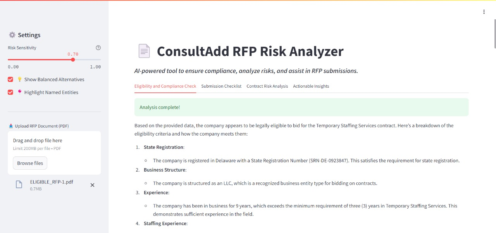
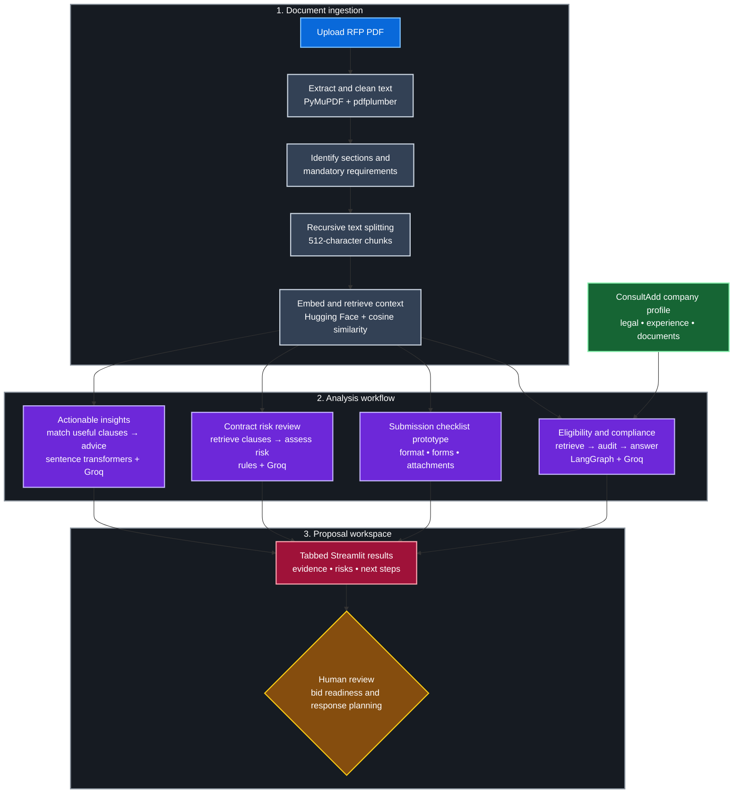
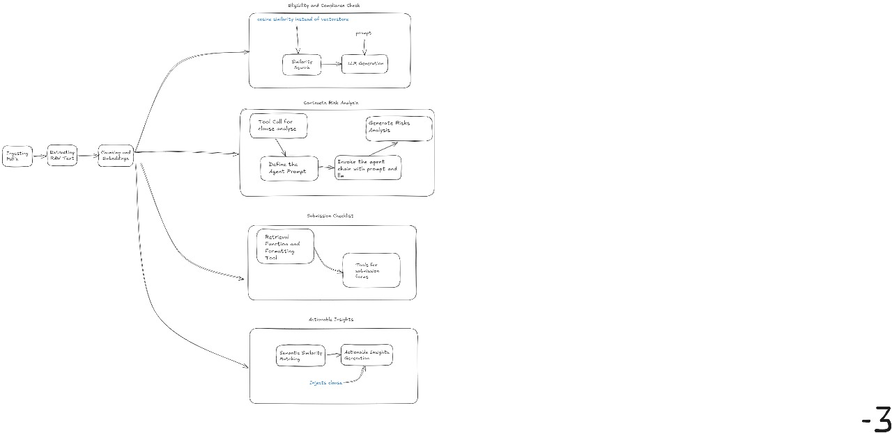

# ConsultAdd RFP Analyzer

An AI-assisted prototype that helps proposal teams evaluate government Requests
for Proposals (RFPs) for eligibility, compliance, submission requirements, and
contract risk.

> Built by **Homer's Hackers** during ConsultAdd's Odyssey of Code hackathon.
> This repository preserves the consolidated demo alongside the experiments the
> team developed during the event.

## The problem

ConsultAdd responds to government RFPs containing detailed project requirements,
legal terms, eligibility conditions, and submission rules. Reviewing these
documents manually is slow, time-sensitive, and vulnerable to human oversight.

The hackathon challenge was to use Generative AI, Retrieval-Augmented Generation
(RAG), and agentic workflows to simplify four parts of that review:

1. Verify whether ConsultAdd is legally and operationally eligible to bid.
2. Extract mandatory qualifications, certifications, and experience criteria.
3. Build a submission checklist covering formatting, forms, and attachments.
4. Identify vendor-unfriendly contract clauses and suggest balanced alternatives.

The complete challenge is included in the repository as the
[original problem statement](docs/odyssey-of-code-problem-statement.pdf).

## Our solution

We built a Streamlit-based RFP analysis workspace that turns an uploaded PDF into
four focused views:

- **Eligibility and compliance:** compares retrieved RFP requirements with
  available company information and explains whether the bid criteria are met.
- **Submission checklist:** surfaces document-format rules, required forms, and
  attachments through the checklist prototype.
- **Contract-risk analysis:** finds potentially unfavorable clauses, classifies
  their risk, and proposes fairer alternatives.
- **Actionable insights:** retrieves relevant clauses and turns them into concise
  steps a proposal team can take to strengthen its response.



## How it works



The main demo combines deterministic document parsing with semantic retrieval and
LLM-assisted analysis. Supporting prototypes in `ooc/agents/` and `ooc/checks/`
explore ReAct-style tools, checklist generation, clause rewriting,
vendor-friendliness scoring, and PDF report export.

## Technology stack

| Area | Technologies |
|---|---|
| Interface | Streamlit |
| Document processing | PyMuPDF, pdfplumber |
| RAG and orchestration | LangChain, LangGraph, recursive text splitting |
| Retrieval | Hugging Face sentence transformers, NumPy cosine similarity |
| Language models | Groq-hosted models |
| Analysis utilities | scikit-learn, pandas |

## Repository structure

```text
.
├── assets/                 # Demo screenshot and original design sketch
├── docs/                   # Original hackathon problem statement
├── ooc/
│   ├── agents/             # Risk, rewriting, scoring, and reporting prototypes
│   ├── checks/             # Submission-checklist experiments
│   ├── data/               # Sample RFPs and company data
│   ├── outputs/            # Example structured analysis output
│   └── risk/               # Consolidated Streamlit application
├── misc/                   # Earlier experiments retained from the hackathon
├── .env.example            # API-key placeholders
└── requirements.txt
```

## Run locally

### 1. Clone and create a virtual environment

```bash
git clone https://github.com/that-rookie-parth/HomersHackers.git
cd HomersHackers
python3 -m venv .venv
source .venv/bin/activate
```

On Windows PowerShell, activate the environment with:

```powershell
.venv\Scripts\Activate.ps1
```

### 2. Install dependencies

```bash
python -m pip install --upgrade pip
pip install -r requirements.txt
pip install pymupdf reportlab
```

`PyMuPDF` and `ReportLab` are installed separately because the hackathon-era
dependency snapshot does not list them explicitly.

### 3. Configure the API key

```bash
cp .env.example .env
```

Add a Groq API key to `.env`:

```dotenv
GROQ_API_KEY=your_groq_api_key
```

### 4. Start the consolidated demo

```bash
cd ooc/risk
streamlit run new_streamlit_ui.py
```

Upload a PDF RFP in the sidebar to begin the analysis.

## Sample material

The repository includes two reference RFPs and supporting company data under
`ooc/data/`. They were supplied for the hackathon to test eligibility,
requirements extraction, and contract review. The filenames do not reliably
identify which example was intended to be ineligible, so this README does not
assign that label without the original attachment metadata.

## Hackathon scope

This is a time-boxed prototype, not a production procurement or legal-review
system. The repository includes parallel experiments, and some capabilities were
demonstrated independently rather than through one fully integrated pipeline.
Outputs should be reviewed by qualified proposal and legal professionals before
being used for a real bid. Provider model availability may also have changed
since the hackathon.

<details>
<summary>Original hackathon architecture sketch</summary>



</details>

## Team

Built by **Homer's Hackers**:

- Parth Kulshreshtha
- Ayush Kumar
- Anisha Shende

## Acknowledgements

Created for the
[Odyssey of Code hackathon](https://unstop.com/hackathons/odyssey-of-code-consultadd-inc-1434772)
organized by ConsultAdd.
